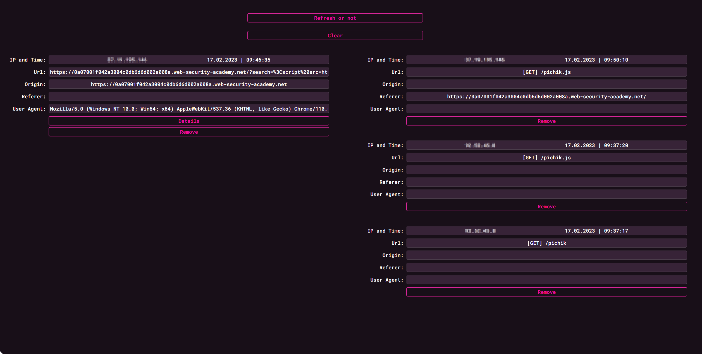

# WebWatcher  
Golang server for testing blind XSS.   
Special endpoint for testing requests and file extensions.  

## Setup  

Setup .wwconfig and add it to your home directory.  
Make sure that `assets` and `templates` are in the directory specified in config.  

Login to your website with /login?token=[token]  

## Usage
After authentication, you can find all requests in `/results/all`.  
Left side is from  XSS requests.  
Right side is from custom path requests.  
  

#### Collecting simple request data from path you specified in config  
This endpoint will contain response specified in `assets/extensions.json` file  

**Example:**  
if you specified `"CollectorPath":"example"` in config file and set .js extensions with payload `alert(1)` in `assets/extensions.json`  
and insert this payload to the website, alert will popup.  
``  

#### Collecting data from blind XSS  
``  
  

